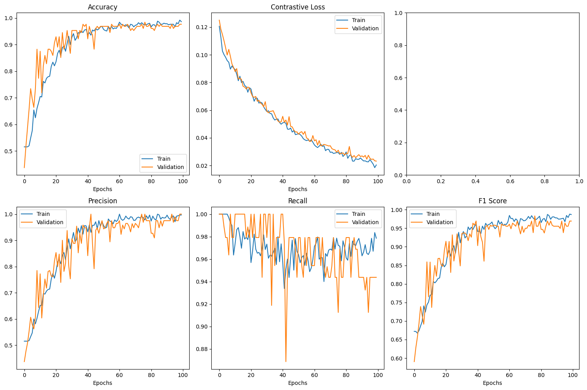
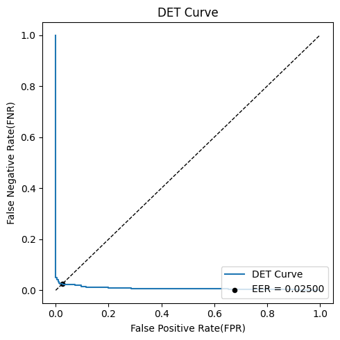
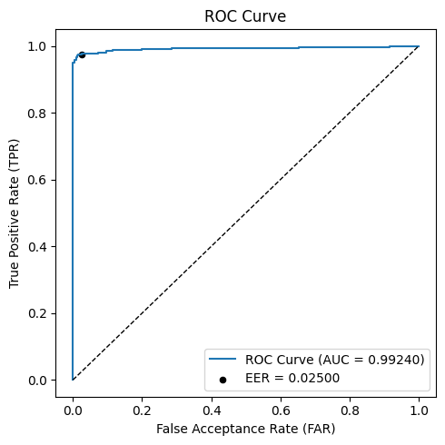
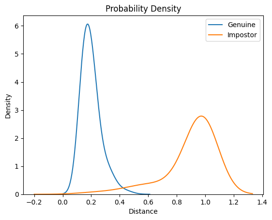

# Siamese-Neural-Networks

## 簡介
程式練習...

訓練一個孿生神經網路，用來將訪問者靜脈特徵與資料庫已註冊的特徵做一對一的個人身份驗證，匹配兩幅靜脈特徵是否為同一人。

參考資料如下:

1. 主架構的部分參考: [Siamese Neural Networks for One-shot Image Recognition](https://www.cs.utoronto.ca/~rsalakhu/papers/oneshot1.pdf)

2. 程式碼建立的部分參考: [Siamese network with Keras, TensorFlow, and Deep Learning](https://pyimagesearch.com/2020/11/30/siamese-networks-with-keras-tensorflow-and-deep-learning/)

3. 損失函數: [Dimensionality Reduction by Learning an Invariant Mapping](https://ieeexplore.ieee.org/document/1640964)

4. 模型訓練指標定義參考: Stack overflow

---

## 手腕靜脈資料集
自己收集的手腕靜脈資料集，同個人分兩個時期拍攝，共640張圖片。 

先是提取手腕感興趣區域，然後再提取感興趣區域的靜脈特徵。

最後製作正對(同個人不同時期的圖)與負對(不同人)的標籤，來訓練神經網路。

如果要替換為自己的時期1與時期2的資料集，請由 `main.ipynb` 中的 `image_dir1` 與 `image_dir2` 載入

本次訓練資料集拆成 8 : 2 用於 訓練 : 驗證

---

## 訓練標籤製作與視覺化

在 `data_loader.py` 中，正對是將同個人不同時期的影像組合在一起，並標示為1(表示同一人)，負對則組合不同人的影像並標示為0(表示不同人)

隨機取幾組正負對視覺化在 `labels_visualization.ipynb`，視覺化時pos表同一人，neg表不同人，如下圖：

## 模型架構

主網路與子網路：

image資料夾內的 圖3(主架構) 跟圖4(子網路)

---

## 損失函數 - 使用對比損失

---

## 模型訓練過程

---

## 訓練結果
Epoch 150: val_loss did not improve from 0.05955
28/28 [==============================] - 2s 58ms/step - loss: 0.0534 - accuracy: 0.9509 - precision: 0.9455 - recall: 0.9546 - f1_score: 0.9468 - val_loss: 0.0710 - val_accuracy: 0.9018 - val_precision: 0.9050 - val_recall: 0.9206 - val_f1_score: 0.9082

在 `test.ipynb` 中可以看到以下指標，用來測試訓練好的模型在自己或其他資料集表現，一樣是把  `test.ipynb` 內 `image_dir1` 與 `image_dir2` 修改為想測試的資料集。

DET 曲線與 EER(%)：

真偽用戶歐幾里得距離分布圖：

在找到 EER 的閾值下，有多少真偽用戶正確跟錯誤訪問系統：

---

## 使用方法
下載後先將 `main.ipynb` 中的 `image_dir1` 與 `image_dir2` 替換成你的資料集，然後執行 `main.ipynb`

---

## Requirements
python==3.9.2

tensorflow(Keras)==2.10.0

opencv-python==4.5.3.56

scikit-learn==1.4.2

numpy==1.26.4

matplotlib==3.8.4

seaborn==0.13.2

imutils==0.5.4

OS：windows10

GPU：RTX3060 12G

CUDA 11.2

cuDNN 8.1.1
